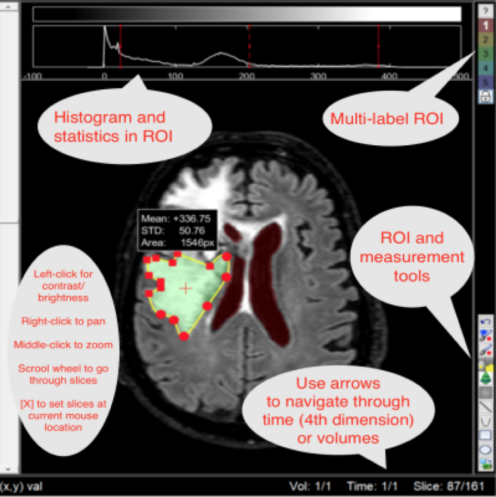
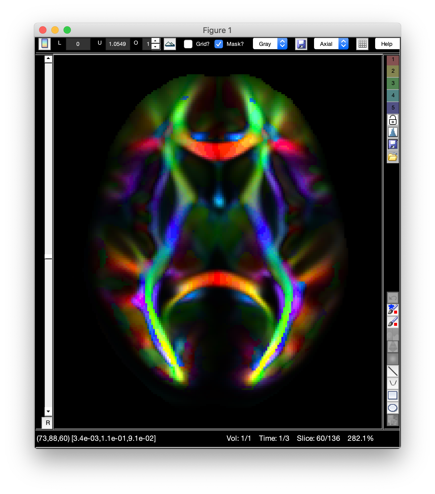

<p align="center">
  
</p>

# imtool3D
[](https://fr.mathworks.com/matlabcentral/fileexchange/74761-imtool3d_td)  
This is an image viewer designed to view a 3D stack of image slices. For example, if you load into matlab a DICOM series of CT or MRI images, you can visualize the images easily using this tool. It lets you scroll through slices, adjust the window and level, make ROI measurements, and export images into standard image formats (e.g., .png, .jpg, or .tif) or the 3D mask as NIFTI file (.nii). Use imtool3D_nii to load NIFTI files.
This tool is written using the object-oriented features of matlab. This means that you can treat the tool like any graphics object and it can easily be embedded into any figure. So if you're designing a GUI in which you need the user to visualize and scroll through image slices, you don't need to write all the code for that! Its already done in this tool! Just create an imtool3D object and put it in your GUI figure.

<p align="center">
  
</p>
  
imtool3D is used heavily by several other projects: [qMRLab](https://github.com/qMRLab/qMRLab), [imquest](https://gitlab.oit.duke.edu/railabs/SameiResearchGroup/imquest), [lesionTool](https://gitlab.oit.duke.edu/railabs/SameiResearchGroup/lesionTool)

* [Dependencies](#dependencies)
* [Demo](#demo)
  * [Mouse Control](#mouse-control)
  * [Segmentation tools](#segmentation-tools)
  * [Measurement tools](#measurement-tools)
  * [Histogram, colormap and statistics](#histogram-colormap-and-statistics) 
  * [Drag and Drop files](#drag-and-drop-files) 
  * [Three planes display (Axial, sagittal and coronal)](#three-planes-display) 
* [Tutorial](#tutorial)
  * [open a 5D volume](#open-a-5d-volume)
  * [open an MRI volume](#open-an-mri-volume)
  * [include imtool3D in a GUI](#include-in-a-gui)
  * [show RGB image](#show-rgb-image)
  * [show montage](#show-montage)
  * [play a video](#play-a-video)
  * [show RGB volume](#show-rgb-volume)
  * [Show a multi-label mask](#show-a-multi-label-mask)
  * [Overlay an image](#overlay-image)
  * [Segment multiple images with a loop](#segment-multiple-images-with-a-loop)
* [Authors](#authors)

# Dependencies
* Matlab's image processing toolbox (ROI tools are disabled otherwise)
* [dicm2nii](https://github.com/xiangruili/dicm2nii) (if NIFTI images are used)

# Demo
[Integration in qMRLab](https://qmrlab.readthedocs.io/en/master/gui_usage.html#data-viewer)
## Mouse control
| Mouse control | action |
|---------------------|--------|
| Middle (shift+) Click and drag | Zoom in/out |
| Left Click and drag | Contrast/Brightness |
| Right (ctrl+) Click and drag | Pan |
| Scroll wheel | Change slice |

  
## Segmentation tools
imtool3D features 3D multi-label mask (ROI) that can be loaded, edited and saved.  

Segmentation strategy in imtool3D consists in adjusting contrast to reveal the targeted structure, and alternating between (1) manual *smart* brush segmentation, (2) active contour, (3) slice interpolation, (4) 3D smoothing of the mask and (5) plane orientation (axial, sagittal or coronal).  
See the demo for [Brain tumor segmentation](https://www.dailymotion.com/embed/video/x7okm8h) using `imtool3D_nii_3planes.m` or `imtool3D_3planes.m`

  
  

| Mask controls | shortcut | action |
|:-------------:|----------|--------|
|  | 1, 2.. | select label number <sub><br />right click on button to delete label. right click on button [5] to set a custom label value. <br />Hover your pointer to get statistics about the label (area, mean value, standard deviation)</sub> |
|  | L | protect or overwrite other labels? |
|  | Z | undo last operation |
|  |  |  |

| 2D tools | shortcut | action |
|:--------:|----------|--------|
|  | B | Brush |
|  | S | Smart brush <sub><br />Segment brush area in two parts using Otsu. <br />Adjust contrast for better results. </sub>|
|  |  | Active contour <sub><br />adjust contrast with mouse control to expand or reduce the mask. <br />Repeat operation until satisfied. Might take a few seconds to run.)</sub> |
|  |  |  |

| Brush tool controls | action |
|:-------------------:|--------|
| Middle click and drag | Change brush diameter |
| Right click | erase |
| double click (smart brush only)| Toggle between bright or dark segmentation |
|  |  |

| 3D tools| action |
|:-------:|--------|
|  | slice interpolation for current label <sub><br />(segment a few non-consecutive slices to enable this feature)</sub> |
|  | smooth mask borders in 3D <sub><br />(segment a few consecutive slices to enable this feature)</sub> |
|  | active contour <sub><br />Operates slice-by-slice. switch orientation (axial, sagittal or coronal) if necessary. <br />Adjust contrast with mouse control to expand or reduce the mask. <br />Repeat operation until satisfied. Might take a few seconds to run.)</sub> |  
|  |  |

## Measurement tools
### Polygon tool
* Measure area  
* Get stats in this area


### Line tool
* Show intensity profile  
* Measure distance in pixels
* Symmetrize the mask (replicate mask with respect to the line)
* Split the mask in two parts

  
## Histogram, colormap and statistics
* Colorbar button on top left to show current slice histogram and colorbar

<p align="left">
  
</p>  

* Use histogram button on the right to get statistics and interactive histogram plot in the different ROI

## Drag and Drop files
* Drag and drop files on the viewer to load them
* Create your own open function for your specific file extention `imreadext.m`. For example (.png file):
````matlab
function I = imreadpng(pngfile)
I = imread(pngfile);
````
* Append in the volume (5th) dimension or replace already loaded data 

<p align="left">
  
</p>  
<p align="left">
  
</p>  

## Three planes display 
Use imtool3D_3planes.m to display the three orientation planes.

<p align="left">
  
</p>  

# Tutorial
## open a 5D volume
````matlab
A = rand(100,100,30,10,3);
imtool3D(A)
````

## open an MRI volume
````matlab
load mri % example mri image provided by MATLAB
D = squeeze(D);
D = permute(D(end:-1:1,:,:),[2 1 3]); % LPI orientation
tool = imtool3D(D);
tool.setAspectRatio([1 1 2.5]) % set voxel size to 1mm x 1mm x 2.5mm
````

## include in a GUI
````matlab
% Add viewer in a panel in the middle of the GUI
GUI = figure('Name','GUI with imtool3D embedded');
annotation(GUI,'textbox',[0 .5 1 .5],'String','Create your own GUI here',...
               'HorizontalAlignment','center','VerticalAlignment','middle');
Position = [0 0 1 .5]; % Bottom. normalized units
tool = imtool3D([],Position,GUI)

% set MRI image
load mri % example mri image provided by MATLAB
D = squeeze(D);
D = permute(D(end:-1:1,:,:),[2 1 3]); % LPI orientation
tool.setImage(D)
tool.setAspectRatio([1 1 2.5]) % set voxel size to 1mm x 1mm x 2.5mm
````

## show RGB image
#### Display a Grayscale Image
````matlab
corn_gray = imread('corn.tif',3); % load the gray version
imtool3D(corn_gray)
````
#### Display an RGB Image
````matlab
corn_RGB = imread('corn.tif',2); % load RGB version
tool=imtool3D(corn_RGB);
tool.isRGB = 1;
````
#### Display an Indexed Image
````matlab
[corn_indexed,map] = imread('corn.tif',1); % load indexed version
tool = imtool3D(corn_indexed);
h = tool.getHandles;
colormap(h.Axes(tool.getNvol),map)
colormap(h.HistImageAxes,map)
tool.setClimits([0 255])
````

## show montage
````matlab
tool = imtool3D;
tool.montage = 1;
````
<p align="center">
  Brain montage: 
</p>
<p align="center">
  
</p>

## play a video
````matlab
v = VideoReader('xylophone.mp4');
tool = imtool3D(v.read([1 Inf]));
tool.isRGB = 1;
````
use left/right arrows to move through image frames  
use shift+right for fast forward (10-by-10 frames)  
## show RGB volume
For this example, we will display color-coded nerve direction of the brain.  
Download HCP Diffusion MRI Template http://brain.labsolver.org/diffusion-mri-templates/hcp-842-hcp-1021
````matlab
%% load HCP Diffusion MRI Template
load('HCP842_1mm.fib','-mat')
% reshape FA
fa0 = reshape(fa0,dimension); fa0 = fa0(:,end:-1:1,:);
% Find diffusion peak direction
peak = reshape(odf_vertices(:,index0+1)',[dimension 3]); 
peak = peak(:,end:-1:1,:,:);

%% Open imtool3D and display
tool = imtool3D(repmat(fa0,[1 1 1 3]).*abs(peak));

% use RGB mode
tool.isRGB = 1;
tool.RGBdim = 4;
tool.RGBindex = [1 2 3];
% move to slice 63
tool.setCurrentSlice(63)
````

<p align="center">
  Brain nerve bundles color-coded by direction: 
</p>
<p align="center">  
(red: left-right, green: antero-posterior, blue: superior-inferior)
</p>
<p align="center">
  
</p>
Use button bellow left slider ('R' on the screenshot) to turn between RGB and grayscale and to select active color channel 

## Show a multi-label mask
In this example, we display the mouse brain atlas [from Allen Institute Website](http://help.brain-map.org/display/mouseconnectivity/API#API-DownloadAtlas3-DReferenceModels)
  
````matlab
% read template and mask
[AVGT, metaAVGT] = nrrdread('average_template_25.nrrd');
[ANO, metaANO] = nrrdread('annotation_25.nrrd');
% renumbering of labels
ic = unique(ANO(:));
for ii=1:length(ic)
    ANO(ANO==ic(ii))=ii;
end

% display
tool = imtool3D(permute(AVGT(end:-1:1,:,:),[3 2 1]));
tool.setMask(permute(ANO(end:-1:1,:,:),[3 2 1]))
tool.setMaskColor(jet(length(ic)))
tool.setAlpha(.1)
````
<p align="left">
  
</p>  

## Overlay image
For this example we will display a map of brain activation extracted from an FMRI dataset.  
Download fmri dataset: http://www2.bcs.rochester.edu/sites/raizada/Matlab/fMRI/speech_brain_images.mat
````matlab
load('speech_brain_images.mat'); % load dataset
tool = imtool3D({subj_3danat speech_Tmap});
tool.setNvol(2); % show top image (brain activation for speech task)
tool.setClimits([1 7]); % threshold activation >1
tool.changeColormap('hot')
tool.setOpacity(.3)
````
<p align="center">
  Brain activation during a speech task:
</b>
<p align="center">
    
</p>

## Segment multiple images with a loop
````matlab
% list your images
imlist = dir(fullfile(toolboxdir('images'),'imdata','BrainMRILabeled','images','vol_*.mat'));
for ii=1:5
    % load image 
    load(fullfile(imlist(ii).folder,imlist(ii).name))
    % display image in imtool3D
    tool = imtool3D(vol);
    % wait for closing imtool3D figure
    waitfor(tool.getHandles.fig);
    % get Mask
    Mask = tool.getMask(1);
    % save Mask
    save(['Mask' num2str(ii) '.mat'],'Mask')
end
````


# what is new in this fork? 
* Support for 5D volumes (scroll through time and volumeS with arrows)
* Keyboard shortcut
* Multi-label mask
* Save mask
* NIFTI files (.nii) support (double click on a. nii file in Matlab filebrowser) 
* New tools for mask (interpolate slices, active contour...)
* Convert Mask2poly and poly2mask
* splines in polygons (double click a circle)
* 3 planes view

# Authors
Justin Solomon (Original release)  
Tanguy Duval (4D (time) and 5D (different contrast); multi-label mask; active_contour, undo button, mask2poly, poly2mask, shortcuts)  

# Original release
https://fr.mathworks.com/matlabcentral/fileexchange/40753-imtool3d
